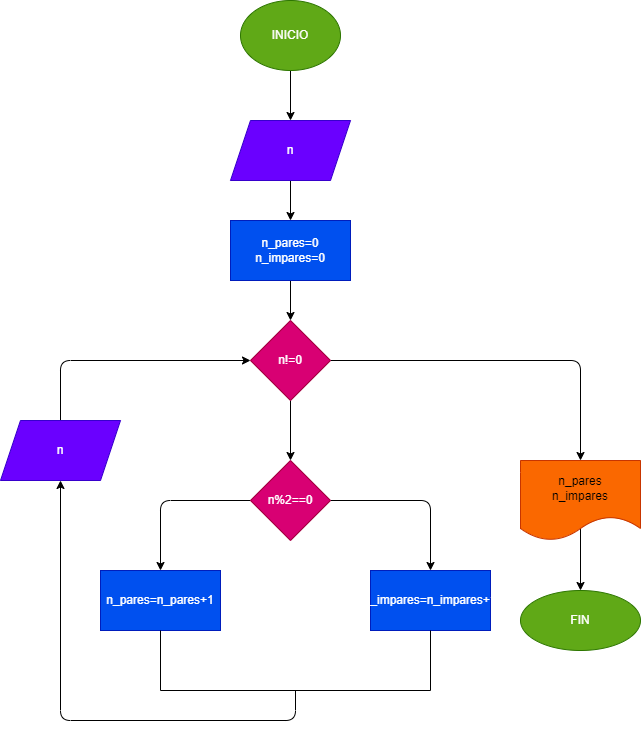

# pares_positivos-

hacer el diagrama de flujo y el programa que lea numero enteros y positivos (1 en cada lectura) y averigue cuantos son pares y cuantos son impares. para terminar usaremos el registro centinela coaundo el valor del nuemro leido sea cero.

